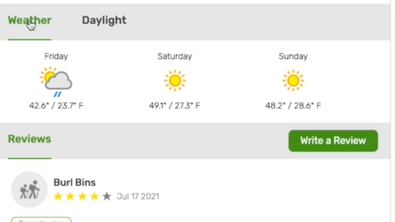

# SomeTrails

[Live site link](https://sometrails.herokuapp.com/#/)


# Overview
SomeTrails is an AllTrails clone which lets you browse available parks and trails through their associated page. Each park page contains a list of available hikes and a brief overview of said hikes, location and direction details for the park, and a summary about the park. Trail pages include more specific data such as specific trail location, statistics about the hike, current and future weather data along with sunrise and sunset times, reviews, and a list of nearby trails.

# Technologies Used
The backend for SomeTrails was built using Ruby on Rails, PostgreSQL for the database, and AWS S3 storage for trail-image associations. The frontend was built using React, Redux, and SCSS. The site uses the Google Maps API (https://developers.google.com/maps) to display Park and Hike locations, and the Weather API (https://www.weatherapi.com/docs/) to display up to date weather forecasts for trails along with the sunrise and sunset data.

# Features
## CRUD designed reviews 
On SomeTrails, users have the ability, after logging in, to leave reviews on available hikes. They also have the ability to read others reviews and extract information such as when the user took that hike, the type of activity they engaged in (hiking, fishing, snowshoeing, etc.), and the trail conditions at the time they went. The review portion of SomeTrails follows a full CRUD cycle letting the user view, create, update, or delete their own reviews. Due to no visual differences between the create and edit form for a review, I was able to create a single shared form with different functionality depending on which action (create or edit) the user wished to complete.

```js
Create Review form
const mSTP = (state, ownProps) => ({
    review: {
        user_id: null,
        trail_id: null,
        date: new Date().toString().slice(4, 15),
        description: "",
        rating: 0,
        activity: "Hiking"
    }
})

Edit Review form
const mSTP = (state, ownProps) => ({
    review: {
        id: ownProps.review.id,
        user_id: ownProps.review.user_id,
        trail_id: ownProps.review.trail_id,
        date: ownProps.review.date,
        description: ownProps.review.description,
        rating: ownProps.review.rating,
        activity: ownProps.review.activity
    }
})
```


## API connected interactivity
API's such as Google Maps and the Weather API were used to provide the user with an interactable experience to help gain further insights about their intended hike. The Weather API was used to showcase current and upcoming forecast data, along with information concerning the current hours for sunrise and sunset. Providing these tools gives the user much needed insight into current and future conditions to help better plan their hike. Weather data was dynamically updated through a componentDidUpdate function, mapping the trail latitude and longitude after it had been fetched from the backend. 

```js
componentDidUpdate(prevProps){
    let { trail } = this.props
        if (trail !== prevProps.trail){
            this.props.fetchWeather({
                lat: trail.latitude,
                long: trail.longitude
            })
        }
    }
```



